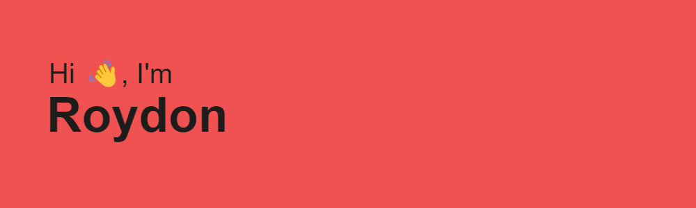

Welcome to my page! I'm a current undergraduate at NUS majoring in Data Science and Analytics. I am an AI and tech enthusiast with a passion for learning and experimenting with new technologies.

## My Personal Projects:
###

### Things I code with:

### Let's Connect:

 

